# Forum Diskusi Sequence Diagrams

Dokumentasi ini berisi sequence diagram untuk sistem forum diskusi asesmen dengan pemisahan alur untuk role Guru dan Siswa.

## 1. Sequence Diagram - Role Siswa

```mermaid
sequenceDiagram
    participant S as Siswa
    participant FE as Frontend (React)
    participant API as API Routes
    participant DB as Database (Prisma)

    %% === Akses Forum - Siswa ===
    Note over S,DB: 1. Akses Forum Diskusi (Role: SISWA)

    S->>FE: Buka halaman asesmen
    FE->>API: GET /api/asesmen/{id}/forum?userId={userId}&userRole=SISWA
    
    %% Validasi Enrollment
    API->>DB: SELECT * FROM enrollment WHERE siswaId = {userId} AND courseId = {courseId}
    DB-->>API: Return enrollment data
    
    alt Siswa belum terdaftar di course
        API-->>FE: HTTP 403 - "Anda tidak terdaftar di course ini"
        FE-->>S: Tampilkan pesan error
    else Siswa sudah terdaftar
        %% Validasi Completion Asesmen
        API->>DB: Cek completion status asesmen
        Note right of DB: Cek tabel nilai/pengumpulan<br/>berdasarkan tipe asesmen
        DB-->>API: Return completion status
        
        alt Siswa belum menyelesaikan asesmen
            API-->>FE: HTTP 403 - "Anda harus menyelesaikan asesmen terlebih dahulu"
            FE-->>S: Tampilkan UI "Forum Terkunci" dengan icon Lock
        else Siswa sudah menyelesaikan asesmen
            API->>DB: SELECT forum discussions dengan balasan
            DB-->>API: Return forum data dengan user info & balasan
            API-->>FE: HTTP 200 + forum discussions data
            FE-->>S: Tampilkan forum diskusi dengan badge "Siswa"
        end
    end

    %% === Membuat Diskusi Baru - Siswa ===
    Note over S,DB: 2. Membuat Diskusi Baru

    S->>FE: Input pesan diskusi di textarea
    S->>FE: Klik tombol "Kirim" atau Ctrl+Enter
    FE->>FE: Validasi pesan tidak kosong
    FE->>API: POST /api/asesmen/{id}/forum<br/>{userId, userRole: "SISWA", pesan}
    
    API->>DB: Validasi ulang enrollment & completion
    
    alt Validasi berhasil
        API->>DB: INSERT INTO forumDiskusi<br/>(asesmenId, userId, pesan)
        DB-->>API: Return diskusi baru dengan user data
        API-->>FE: HTTP 201 + data diskusi baru
        FE->>FE: Tambahkan diskusi ke state discussions
        FE-->>S: Update UI: tampilkan diskusi baru di atas
        FE->>FE: Reset textarea & focus
    else Validasi gagal
        API-->>FE: HTTP 403 - Error message
        FE-->>S: Tampilkan toast error
    end

    %% === Membalas Diskusi - Siswa ===
    Note over S,DB: 3. Membalas Diskusi

    S->>FE: Klik tombol "Reply" pada diskusi
    FE->>FE: Set replyingTo state & focus textarea
    S->>FE: Input balasan di textarea reply
    S->>FE: Klik "Balas" atau Ctrl+Enter
    
    FE->>API: POST /api/asesmen/{id}/forum/{forumId}<br/>{userId, userRole: "SISWA", pesan}
    API->>DB: Cek forum diskusi exists
    API->>DB: Validasi enrollment & completion
    
    alt Validasi berhasil
        API->>DB: INSERT INTO balasanForum<br/>(forumDiskusiId, userId, pesan)
        DB-->>API: Return balasan baru dengan user data
        API-->>FE: HTTP 201 + data balasan baru
        FE->>FE: Update diskusi dengan balasan baru
        FE-->>S: Tampilkan balasan baru, reset reply form
    else Validasi gagal
        API-->>FE: HTTP 403 - Error message
        FE-->>S: Tampilkan toast error
    end

    %% === Menghapus Konten Sendiri - Siswa ===
    Note over S,DB: 4. Menghapus Diskusi/Balasan Sendiri

    alt Menghapus Diskusi Sendiri
        S->>FE: Klik tombol delete (hanya muncul pada diskusi milik sendiri)
        FE->>FE: Konfirmasi delete (optional)
        FE->>API: DELETE /api/asesmen/{id}/forum<br/>?discussionId={id}&userId={userId}&userRole=SISWA
        
        API->>DB: SELECT diskusi WHERE id = {discussionId} AND userId = {userId}
        
        alt Siswa adalah pemilik diskusi
            API->>DB: DELETE FROM forumDiskusi WHERE id = {discussionId}
            DB-->>API: Deletion success
            API-->>FE: HTTP 200 - "Diskusi berhasil dihapus"
            FE->>FE: Remove diskusi dari state
            FE-->>S: Update UI tanpa diskusi yang dihapus
        else Siswa bukan pemilik
            API-->>FE: HTTP 403 - "Anda tidak memiliki izin"
            FE-->>S: Tampilkan toast error
        end
    end

    alt Menghapus Balasan Sendiri
        S->>FE: Klik delete pada balasan milik sendiri
        FE->>API: DELETE /api/asesmen/{id}/forum/{forumId}<br/>?replyId={id}&userId={userId}&userRole=SISWA
        
        API->>DB: Cek ownership balasan
        
        alt Siswa adalah pemilik balasan
            API->>DB: DELETE balasan
            DB-->>API: Success
            API-->>FE: HTTP 200
            FE->>FE: Remove balasan dari diskusi
            FE-->>S: Update UI tanpa balasan yang dihapus
        else Tidak authorized
            API-->>FE: HTTP 403
            FE-->>S: Error message
        end
    end

    %% === Expand/Collapse Balasan ===
    Note over S,DB: 5. Navigasi & Interaksi

    S->>FE: Klik "Lihat balasan" atau chevron
    FE->>FE: Toggle expandedDiscussions state
    FE-->>S: Tampilkan/sembunyikan balasan

    S->>FE: Scroll dalam forum
    FE->>FE: Lazy loading jika diperlukan
    FE-->>S: Smooth scrolling experience
```

## 2. Sequence Diagram - Role Guru

```mermaid
sequenceDiagram
    participant G as Guru
    participant FE as Frontend (React)
    participant API as API Routes
    participant DB as Database (Prisma)

    %% === Akses Forum - Guru ===
    Note over G,DB: 1. Akses Forum Diskusi (Role: GURU)

    G->>FE: Buka halaman asesmen (sebagai guru)
    FE->>API: GET /api/asesmen/{id}/forum?userId={userId}&userRole=GURU
    
    %% Guru memiliki akses penuh
    API->>DB: SELECT forum discussions dengan semua balasan
    Note right of DB: Tidak perlu validasi completion<br/>Guru selalu punya akses
    DB-->>API: Return semua forum data
    API-->>FE: HTTP 200 + complete forum data
    FE-->>G: Tampilkan forum lengkap dengan badge "Guru" & icon GraduationCap

    %% === Moderasi & Monitoring ===
    Note over G,DB: 2. Monitoring Aktivitas Forum

    G->>FE: Melihat semua diskusi & balasan
    FE-->>G: Tampilkan dengan highlight role (Guru/Siswa badges)
    
    G->>FE: Melihat timestamp & user info lengkap
    FE-->>G: Format waktu relatif (X menit lalu, dll)

    %% === Membuat Diskusi - Guru ===
    Note over G,DB: 3. Membuat Diskusi Baru (Privilege Penuh)

    G->>FE: Input pesan diskusi (sebagai moderator/guide)
    G->>FE: Klik tombol "Kirim"
    FE->>API: POST /api/asesmen/{id}/forum<br/>{userId, userRole: "GURU", pesan}
    
    %% Tidak ada validasi completion untuk guru
    API->>DB: INSERT INTO forumDiskusi<br/>(asesmenId, userId, pesan)
    Note right of DB: Guru bypass semua validasi<br/>completion & enrollment
    DB-->>API: Return diskusi baru dengan user data (role: GURU)
    API-->>FE: HTTP 201 + diskusi dengan badge Guru
    FE->>FE: Tambahkan diskusi dengan styling khusus guru
    FE-->>G: Tampilkan diskusi dengan badge "Guru" prominent

    %% === Membalas Diskusi - Guru ===
    Note over G,DB: 4. Memberikan Feedback/Guidance

    G->>FE: Klik reply pada diskusi siswa
    G->>FE: Input balasan (feedback/guidance)
    FE->>API: POST /api/asesmen/{id}/forum/{forumId}<br/>{userId, userRole: "GURU", pesan}
    
    API->>DB: INSERT balasan dengan role GURU
    DB-->>API: Return balasan dengan user data guru
    API-->>FE: HTTP 201 + balasan guru
    FE->>FE: Highlight balasan guru (badge + styling khusus)
    FE-->>G: Tampilkan balasan dengan authority tinggi

    %% === Moderasi Konten ===
    Note over G,DB: 5. Moderasi & Penghapusan Konten

    alt Menghapus Diskusi Apa Pun
        G->>FE: Klik delete pada diskusi (milik siapa pun)
        Note over FE: Button delete selalu visible<br/>untuk guru pada semua konten
        FE->>FE: Konfirmasi moderasi action
        FE->>API: DELETE /api/asesmen/{id}/forum<br/>?discussionId={id}&userId={userId}&userRole=GURU
        
        API->>DB: DELETE diskusi (tanpa cek ownership)
        Note right of DB: Guru dapat hapus konten<br/>siapa pun untuk moderasi
        DB-->>API: Deletion success
        API-->>FE: HTTP 200 - "Diskusi berhasil dihapus"
        FE->>FE: Remove diskusi dari UI
        FE-->>G: Update UI dengan pesan moderasi berhasil
    end

    alt Menghapus Balasan Apa Pun
        G->>FE: Klik delete pada balasan (milik siapa pun)
        FE->>API: DELETE /api/asesmen/{id}/forum/{forumId}<br/>?replyId={id}&userId={userId}&userRole=GURU
        
        API->>DB: DELETE balasan (privilege guru)
        DB-->>API: Success
        API-->>FE: HTTP 200
        FE->>FE: Remove balasan dengan animasi
        FE-->>G: Konfirmasi moderasi berhasil
    end

    %% === Manajemen Forum ===
    Note over G,DB: 6. Manajemen & Analytics

    G->>FE: Melihat statistik partisipasi
    FE->>FE: Hitung jumlah diskusi, balasan per siswa
    FE-->>G: Tampilkan metrics engagement

    G->>FE: Filter/sort diskusi berdasarkan criteria
    FE->>FE: Client-side filtering & sorting
    FE-->>G: View terorganisir sesuai preferensi

    alt Notifikasi Real-time
        Note over API: Ada aktivitas forum baru dari siswa
        API->>FE: Push notification/WebSocket update
        FE->>FE: Highlight konten baru dengan badge "NEW"
        FE-->>G: Notifikasi diskusi/balasan baru butuh perhatian
    end

    %% === Guidance & Feedback ===
    Note over G,DB: 7. Memberikan Guidance Edukatif

    G->>FE: Buat diskusi pembuka/panduan
    FE->>API: POST diskusi dengan konten edukatif
    API->>DB: Save dengan metadata khusus (pinned/important)
    DB-->>API: Success
    API-->>FE: Return diskusi dengan priority tinggi
    FE-->>G: Tampilkan diskusi sebagai "Pinned" atau highlighted

    G->>FE: Reply dengan feedback konstruktif ke siswa
    FE->>API: POST balasan dengan tone edukatif
    API->>DB: Save balasan guru
    DB-->>API: Success dengan metadata guru
    API-->>FE: Return balasan dengan styling authority
    FE-->>G: Confirm feedback tersampaikan ke siswa
```

## 3. Perbandingan Fitur Berdasarkan Role

### **Siswa (SISWA)**

| Fitur | Akses | Kondisi | Batasan |
|-------|-------|---------|---------|
| **Lihat Forum** | ✅ Terbatas | Harus menyelesaikan asesmen | Forum terkunci jika belum selesai |
| **Buat Diskusi** | ✅ Ya | Setelah selesai asesmen | Harus terdaftar di course |
| **Balas Diskusi** | ✅ Ya | Setelah selesai asesmen | Hanya pada diskusi aktif |
| **Hapus Konten** | ⚠️ Terbatas | Hanya milik sendiri | Tidak bisa hapus konten orang lain |
| **Moderasi** | ❌ Tidak | - | Tidak ada hak moderasi |
| **Badge** | 👤 "Siswa" | Selalu tampil | Badge standar |

### **Guru (GURU)**

| Fitur | Akses | Kondisi | Privilege |
|-------|-------|---------|-----------|
| **Lihat Forum** | ✅ Penuh | Selalu | Akses semua diskusi & balasan |
| **Buat Diskusi** | ✅ Unlimited | Tanpa batasan | Bypass semua validasi |
| **Balas Diskusi** | ✅ Unlimited | Pada diskusi apa pun | Authority tinggi |
| **Hapus Konten** | ✅ Semua | Moderasi penuh | Hapus konten siapa pun |
| **Moderasi** | ✅ Penuh | Tools moderasi lengkap | Kontrol penuh forum |
| **Badge** | 🎓 "Guru" | Prominent styling | Icon GraduationCap |

## 4. Alur Validasi & Security

### Validasi untuk Siswa:
1. **Enrollment Check**: Pastikan siswa terdaftar di course
2. **Completion Check**: Validasi asesmen sudah diselesaikan
3. **Ownership Check**: Hanya bisa hapus konten sendiri
4. **Content Validation**: Validasi input tidak kosong

### Privilege untuk Guru:
1. **Bypass Validation**: Tidak perlu validasi completion
2. **Full Access**: Akses semua fitur tanpa batasan
3. **Moderation Rights**: Hapus konten siapa pun
4. **Priority Display**: Konten guru ditampilkan dengan styling khusus

## 5. Tabel Pengujian Forum Diskusi

### **Pengujian Fungsional**

| Modul / Fitur | Skenario Pengujian (Test Case) | Hasil yang Diharapkan |
|---------------|--------------------------------|------------------------|
| **Akses Forum - Role Siswa** | Siswa yang belum terdaftar di course mencoba mengakses forum diskusi | Sistem menampilkan error HTTP 403 dengan pesan "Anda tidak terdaftar di course ini" |
| | Siswa terdaftar tapi belum menyelesaikan asesmen mencoba mengakses forum | Sistem menampilkan UI "Forum Terkunci" dengan icon Lock dan pesan informasi |
| | Siswa yang sudah menyelesaikan asesmen mengakses forum | Forum diskusi terbuka penuh dengan badge "Siswa" dan akses untuk membuat/membalas diskusi |
| **Akses Forum - Role Guru** | Guru mengakses forum diskusi asesmen | Forum langsung terbuka tanpa validasi, menampilkan semua diskusi dengan badge "Guru" dan icon GraduationCap |
| **Membuat Diskusi Baru - Siswa** | Siswa yang sudah selesai asesmen membuat diskusi baru dengan pesan valid | Sistem menyimpan diskusi ke database dan menampilkan di UI dengan badge "Siswa" |
| | Siswa mencoba submit diskusi dengan textarea kosong | Frontend mencegah pengiriman, sistem tidak melakukan API call |
| | Siswa yang belum selesai asesmen mencoba POST diskusi | API menolak dengan HTTP 403 dan pesan error validasi |
| **Membuat Diskusi Baru - Guru** | Guru membuat diskusi baru tanpa batasan completion | Sistem langsung menyimpan diskusi dengan badge "Guru" prominent dan styling khusus |
| **Membalas Diskusi - Siswa** | Siswa klik reply pada diskusi dan menulis balasan valid | Balasan tersimpan dan muncul di UI dengan badge "Siswa", form reply di-reset |
| | Siswa yang belum selesai asesmen mencoba membalas | API menolak dengan HTTP 403 dan validasi completion |
| **Membalas Diskusi - Guru** | Guru membalas diskusi siswa dengan feedback | Balasan tersimpan dengan styling authority tinggi dan badge "Guru" |
| **Hapus Diskusi - Siswa** | Siswa menghapus diskusi milik sendiri | Diskusi terhapus dari database dan UI, tombol delete hanya muncul pada konten sendiri |
| | Siswa mencoba hapus diskusi milik orang lain | Tombol delete tidak muncul di UI, jika dipaksa API menolak dengan HTTP 403 |
| **Hapus Diskusi - Guru** | Guru menghapus diskusi milik siapa pun (moderasi) | Diskusi terhapus dari database dan UI, tombol delete muncul pada semua konten |
| **Hapus Balasan - Siswa** | Siswa menghapus balasan milik sendiri | Balasan terhapus dari diskusi, counter balasan berkurang |
| | Siswa mencoba hapus balasan orang lain | API menolak dengan HTTP 403 ownership error |
| **Hapus Balasan - Guru** | Guru menghapus balasan siapa pun untuk moderasi | Balasan terhapus dengan animasi, konfirmasi moderasi berhasil |
| **Navigasi Forum** | User klik tombol "Lihat balasan" atau chevron expand | Balasan ditampilkan/disembunyikan dengan toggle state |
| | User scroll dalam area forum | Smooth scrolling experience, lazy loading jika diperlukan |

### **Pengujian Non-Fungsional**

| Modul / Fitur | Skenario Pengujian (Test Case) | Hasil yang Diharapkan |
|---------------|--------------------------------|------------------------|
| **Kinerja (Performance)** | Memuat forum dengan 50+ diskusi dan 200+ balasan | Forum terbuka dalam waktu < 2 detik dengan pagination atau lazy loading |
| | Mengirim diskusi/balasan baru | Response API dan update UI dalam waktu < 500ms |
| | Multiple users mengakses forum bersamaan | Server menangani concurrent requests tanpa performance degradation |
| **Keamanan (Security)** | Mencoba akses API forum tanpa authentication | Middleware menolak request dan redirect ke login |
| | Siswa mencoba manipulasi userId di API call | Server validasi token JWT dan menolak request invalid |
| | Mencoba SQL injection pada input forum | Prisma ORM mencegah SQL injection, input di-sanitize |
| | XSS attack melalui input diskusi/balasan | Input di-escape dan sanitize, script tidak ter-eksekusi |
| **Validasi Input** | Input diskusi dengan karakter khusus dan emoji | Sistem menerima dan menampilkan karakter dengan benar |
| | Input diskusi melebihi batas maksimal (contoh: >1000 karakter) | Frontend/API menolak dan menampilkan pesan batas karakter |
| | Upload gambar dalam diskusi (jika ada fitur) | File ter-upload ke storage, link berfungsi, dan gambar tampil |
| **Kompatibilitas Browser** | Mengakses forum di Chrome, Firefox, Safari, Edge | UI forum responsive dan fungsional di semua browser modern |
| | Forum di mobile device (responsive) | Layout menyesuaikan layar mobile, touch interaction berfungsi |
| **Real-time & Notifikasi** | User A membuat diskusi, User B melihat update tanpa refresh | WebSocket/polling mengirim update real-time ke semua user aktif |
| | Guru mendapat notifikasi diskusi baru dari siswa | Sistem menampilkan badge "NEW" atau highlight pada konten baru |
| **Accessibility** | Navigasi forum menggunakan keyboard (tab navigation) | Semua elemen dapat diakses dengan keyboard, focus indicator jelas |
| | Screen reader pada konten forum | Alt text dan ARIA labels terbaca dengan benar |
| **Load Testing** | 100 user concurrent mengakses forum bersamaan | Server stabil, response time tetap acceptable (<3 detik) |
| | Stress test dengan 1000+ diskusi dalam satu asesmen | Pagination/virtualization berfungsi, memory usage terkontrol |

### **Pengujian Edge Cases**

| Modul / Fitur | Skenario Pengujian (Test Case) | Hasil yang Diharapkan |
|---------------|--------------------------------|------------------------|
| **Network Issues** | Koneksi internet terputus saat mengirim diskusi | Sistem menampilkan pesan error dan menyimpan draft lokal (jika ada) |
| | Timeout pada API request forum | Loading state berakhir, error message informatif ditampilkan |
| **Data Consistency** | Diskusi dihapus saat user lain sedang membalas | API menangani race condition, error handling yang proper |
| | Multiple users membalas diskusi bersamaan | Semua balasan tersimpan dengan timestamp yang benar |
| **Authorization Edge Cases** | Role user berubah saat sedang mengakses forum | Middleware mendeteksi perubahan dan update permissions real-time |
| | Token JWT expired saat di tengah aktivitas forum | Auto-refresh token atau redirect ke login dengan save state |
| **Database Issues** | Database connection error saat fetch forum | Graceful error handling, retry mechanism, fallback message |
| | Disk space penuh saat menyimpan diskusi | Error handling yang informatif, tidak crash aplikasi |

---

> **Note**: Diagram dan tabel pengujian ini mencerminkan implementasi aktual pada aplikasi LMS dengan pemisahan yang jelas antara alur siswa dan guru, termasuk validasi, security, dan user experience yang berbeda untuk setiap role.
